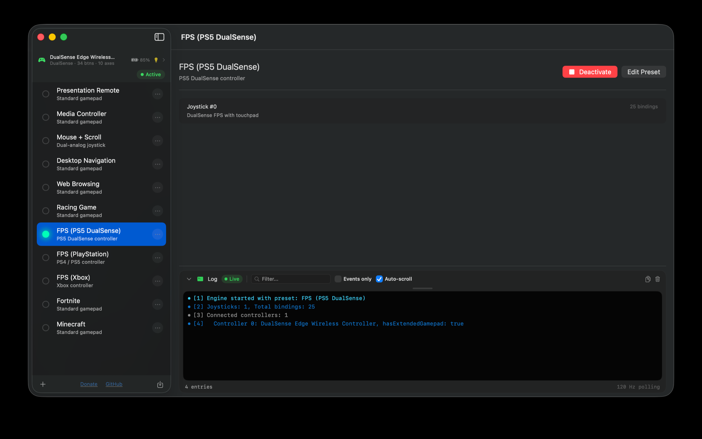

# JoystickConfig

Map any game controller to keyboard and mouse on macOS.

## Features

- Map buttons, triggers, joysticks, and d-pad to keyboard keys
- Map joysticks to mouse movement and scroll wheel
- Macro sequences with custom timing per step
- Turbo (rapid fire) on any button
- Toggle mode, deadzones, axis inversion, sensitivity curves
- DualSense light bar color control
- Unlimited presets with one-click switching
- Import, export, and share presets
- Convert presets between controller types
- 120Hz input polling
- Native macOS app (SwiftUI)

## Supported Controllers

- PlayStation DualSense (PS5) and DualSense Edge
- PlayStation DualShock 4 (PS4)
- Xbox Wireless Controller
- Any MFi or HID-compatible gamepad

## Requirements

- macOS 14.0 or later
- Accessibility permission (for keyboard/mouse simulation)

## Building

1. Open `JoystickConfig.xcodeproj` in Xcode 16+
2. Select your team in Signing & Capabilities
3. Build and run

## License

MIT License. See [LICENSE](LICENSE) for details.

## Privacy

JoystickConfig does not collect any data. See [PRIVACY.md](PRIVACY.md).
