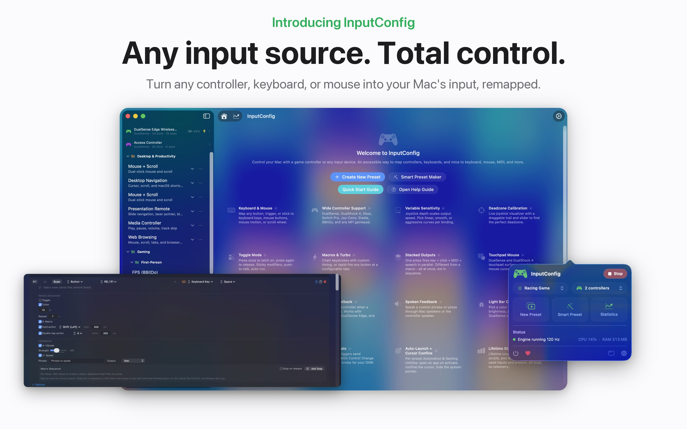
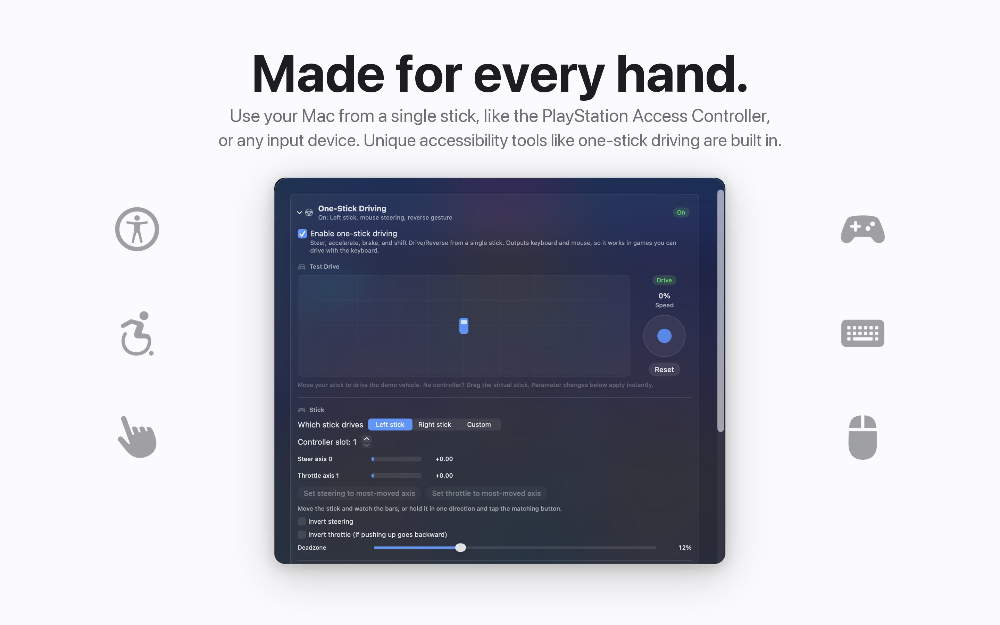
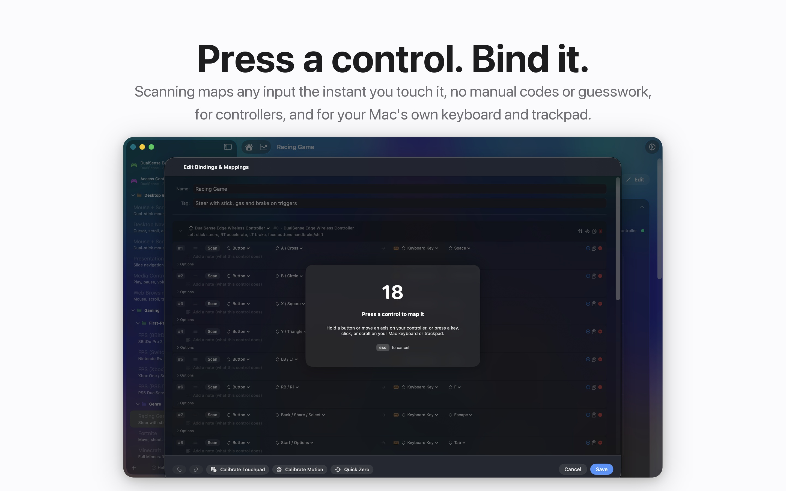
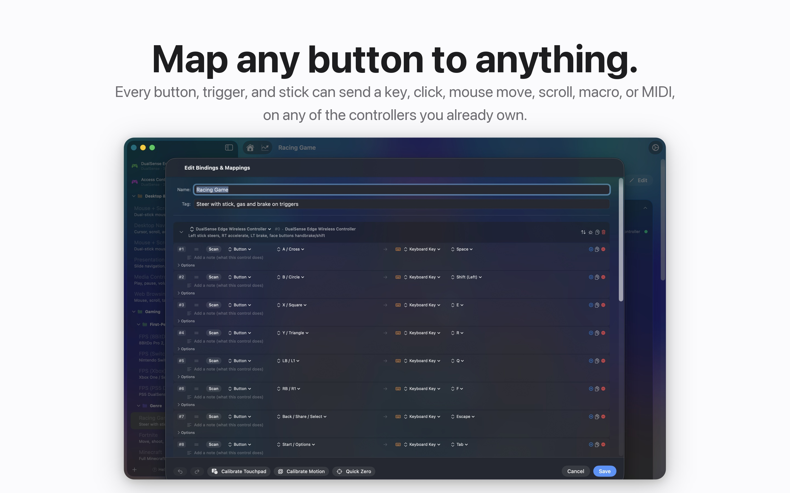
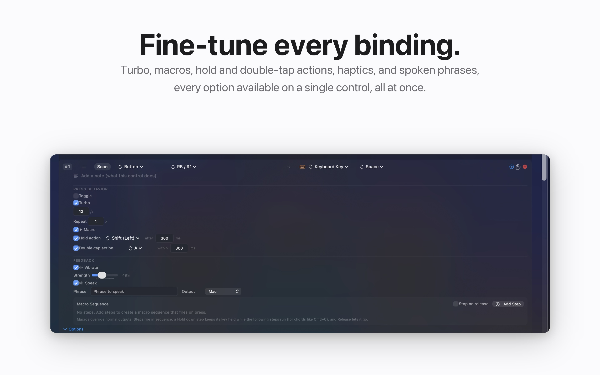
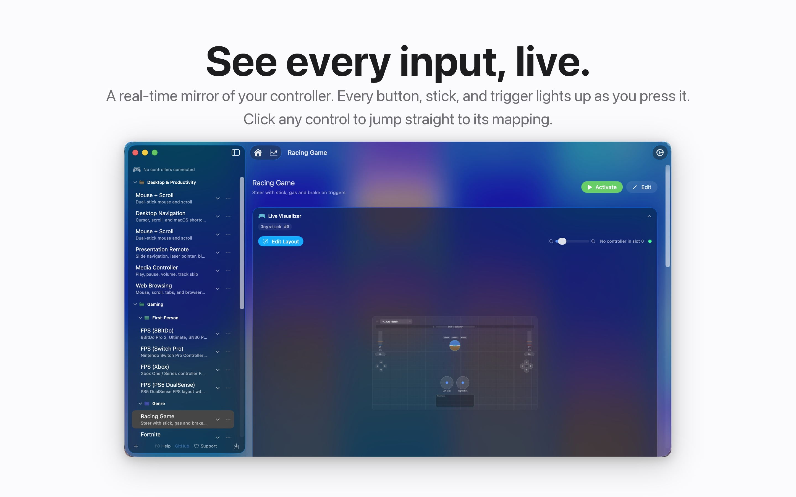
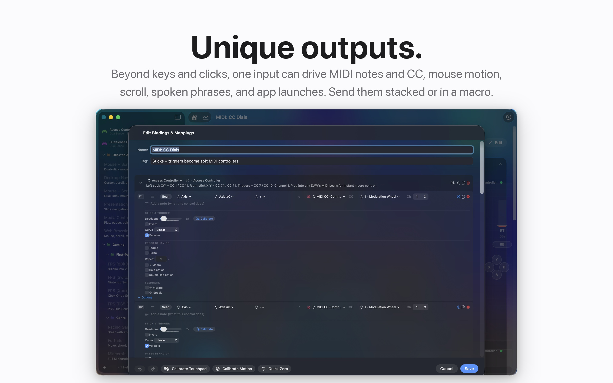
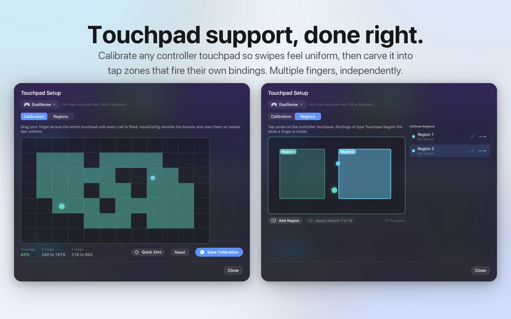
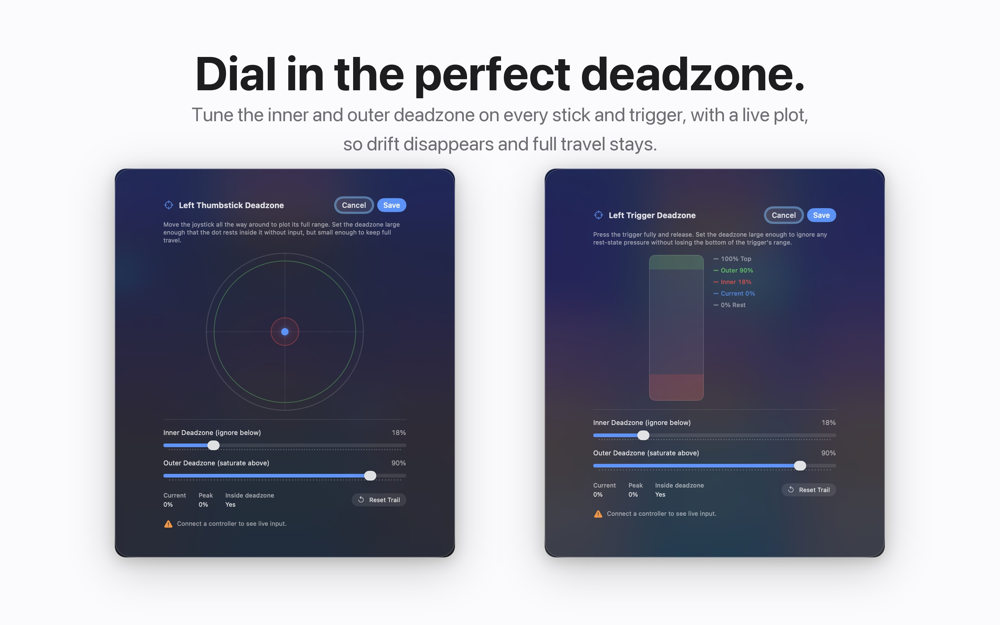
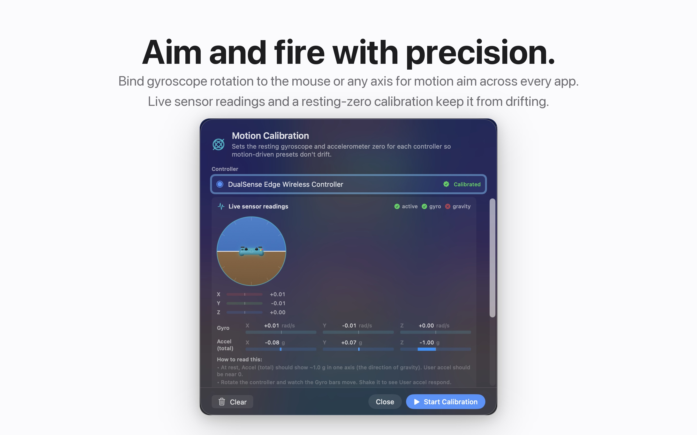

# InputConfig

This local branch adds a versioned command-line interface. Build and run with
`./script/build_and_run.sh run`; see `Tools/inputconfigctl --help`. The CLI
uses atomic JSON request/response files in the user's Application Support and a Darwin
notification, and supports dry runs plus full-fidelity Codable resources.

InputConfig is a free, open-source controller mapper for macOS. It turns any game
controller into a keyboard and mouse, so a gamepad can drive your whole Mac: browse the
web, control apps, play games that never supported controllers, or replace a keyboard
entirely if using one is difficult.

Works with PS5 DualSense, DualShock 4, Xbox Wireless, Switch Pro, 8BitDo, and any
HID-compatible gamepad. No drivers, no subscription, no account.

## Overview

InputConfig lets you use any game controller as a keyboard and mouse on your Mac. Plug in your controller, pick a preset, and go. Or build your own from scratch.

Works with DualSense (PS5), DualSense Edge, DualShock 4 (PS4), Xbox Wireless, Nintendo Switch Pro, 8BitDo, and any MFi or HID-compatible gamepad. No drivers needed.

You can map to more than keys and clicks. Type whole phrases, send MIDI to a DAW, or control InputConfig itself from a button. And it is not just for game controllers: your Mac keyboard, mouse, and trackpad can be inputs too, including Force Touch trackpad pressure.

Open InputConfig and everything it can do is on one screen. Start a preset from scratch,
let the Smart Preset Maker build one for you, or open a guide. Hundreds of presets ship
with it, sorted into folders you can name and colour.

Drive your whole Mac from a single stick. One-stick driving steers, accelerates, brakes,
and shifts from one control, and it outputs keyboard and mouse, so it works in games that
never planned for it. Built with the PlayStation Access Controller and other adaptive
hardware in mind.

Scanning maps any input the instant you touch it. No manual codes, no guesswork, and it
works for your Mac's own keyboard and trackpad too.

Every button, trigger, and stick can send a key, a click, mouse motion, scroll, a macro, or
MIDI, across every controller you own at once.

Turbo, macros, hold and double-tap actions, haptics, and spoken phrases are all available
on a single control at the same time.

The live visualizer mirrors your controller in real time. Every button, stick, and trigger
lights up as you press it, and clicking any control jumps straight to its mapping.

Beyond keys and clicks, one input can drive MIDI notes and CC, spoken phrases, and app
launches, sent stacked or in sequence.

Calibrate a controller touchpad so swipes feel uniform, then carve it into tap zones that
fire their own bindings, with multiple fingers tracked independently.

Tune the inner and outer deadzone on every stick and trigger with a live plot, so drift
disappears and full travel stays. This matters a great deal for tremor or limited range of
motion.

Bind gyroscope rotation to the mouse or any axis for motion aim in any app. Live sensor
readings and a resting-zero calibration keep it from drifting.

## How it compares

| | InputConfig | Joystick Mapper | Gamepad Companion | Enjoyable | Karabiner-Elements |
|---|---|---|---|---|---|
| Cost | Free | Paid | Paid | Free | Free |
| Open source | Yes, MIT | No | No | Yes | Yes |
| Game controllers | Yes | Yes | Yes | Yes | No, keyboards only |
| Mac keyboard/mouse/trackpad as input | Yes | No | No | No | Keyboard only |
| Per-app preset switching | Yes | No | No | No | Yes |
| Macros, turbo, tap and hold | Yes | Limited | Limited | No | Limited |
| MIDI output | Yes | No | No | No | No |
| Gyroscope and motion | Yes | No | No | No | No |
| Light bar control | Yes | No | No | No | No |
| Still updated | Yes | Rarely | Rarely | No | Yes |

Checked August 2026. Some of these have been around far longer than mine and are good
tools. Check for yourself before you switch.

## Features

- Map buttons, triggers, joysticks, and D-pad to keyboard keys, mouse movement, mouse buttons, and scroll wheel
- Type whole words or phrases from a single button
- Trigger app actions from your controller: switch presets, jump to a specific preset, or pause and resume output
- Tap and hold for two actions on one button, a quick tap does one thing and holding does another
- Double tap a button for a third action
- Use your Mac keyboard, mouse, and trackpad as inputs too, including Force Touch trackpad pressure and Force Click
- Switch presets automatically based on the app you are using
- One-stick driving: steer, accelerate, brake, and shift from a single stick, for games that never supported it
- Smart Preset Maker builds a preset for you from a few questions
- Hundreds of built-in presets for adaptive controllers, desktop navigation, web browsing, media control, popular games, and Mac apps
- Live controller visualizer mirrors your input in real time
- Record macro sequences with custom timing, including chord steps that hold one key while tapping others
- Turbo (rapid fire) and toggle mode on any button
- Map cursor zones, stick zones, and touchpad regions and gestures
- Adjustable deadzones, axis inversion, and sensitivity curves with visual calibration
- Customize controller light bar colors per preset with a full RGB color picker
- Send MIDI output to your favorite DAW
- Built-in 3D gyroscope and motion tracking
- Spoken and haptic feedback
- Available in 12 languages
- Create unlimited presets and switch instantly
- Import, export, and share presets between users
- Convert presets between controller types
- Works with any HID-compatible gamepad, no drivers needed
- Lifetime usage statistics

100% free.

## Supported Controllers

- PlayStation Access Controller (and other adaptive hardware)
- PlayStation DualSense (PS5) and DualSense Edge
- PlayStation DualShock 4 (PS4)
- Xbox Wireless Controller
- Nintendo Switch Pro Controller
- 8BitDo controllers
- Any MFi or HID-compatible gamepad
- Your Mac keyboard, mouse, and trackpad can also be used as inputs

## Questions people ask

**How do I use a PS5 or Xbox controller as a keyboard and mouse on Mac?**
Install InputConfig, plug in or pair the controller, pick a preset, and press Activate.
macOS will ask for Accessibility permission the first time, which is what lets any app send
keystrokes and mouse movement.

**Is there a free alternative to Joystick Mapper or Gamepad Companion?**
This is one. InputConfig is free with nothing locked, and the source is public under MIT.

**Can I use a controller instead of a keyboard and mouse entirely?**
Yes, that is the point. There are built-in presets for desktop navigation, web browsing,
and media control, plus presets built for adaptive controllers. You can map cursor zones,
type whole phrases from one button, and switch presets automatically per app.

**Does it work with the PlayStation Access Controller or the Xbox Adaptive Controller?**
Yes, along with anything else that presents as an MFi or HID gamepad. There are presets
built for adaptive setups, and one-stick driving lets a single stick handle steering,
throttle, braking, and gear changes. Accessibility is why the app exists, not an
afterthought.

**Do I need drivers?**
No. Connect the controller by USB or Bluetooth and macOS handles the rest.

**Can I map a controller for a game that has no controller support?**
Yes. Map the buttons and sticks to whatever keys and mouse motion the game expects, and it
sees a normal keyboard and mouse.

**Is it really free?**
Yes. No paid tier, no trial, no locked features. There is a tip jar in the app that unlocks
nothing.

## Requirements

- macOS 14.0 or later
- Accessibility permission (for keyboard and mouse simulation)

## Building

1. Open `InputConfig.xcodeproj` in Xcode 26 or later
2. Select your team in Signing & Capabilities
3. Build and run

## License

MIT License. See [LICENSE](LICENSE) for details.

## Privacy

InputConfig does not collect any data. See [PRIVACY.md](PRIVACY.md).

## Contact

Questions, bugs, or feature requests? Reach out at [ryleighnewman.com](https://ryleighnewman.com).
